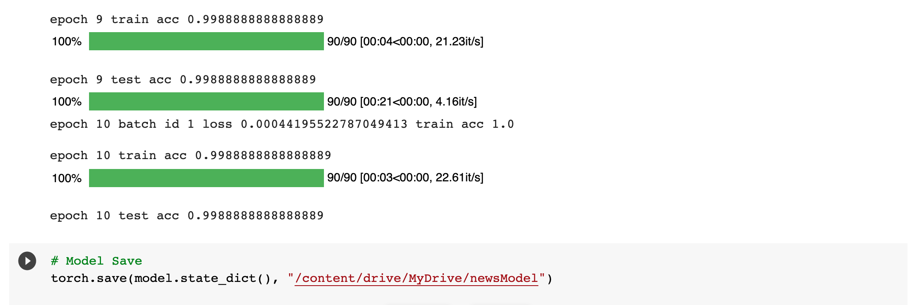

# NLP_project
naver_movie_review 구분

* Colab파일
[Result.ipynb 코랩에서 보기](https://colab.research.google.com/github/BussNam/NLP_project/blob/main/Result.ipynb)
<html>
<table class="tfo-notebook-buttons" align="left">
<!--   <td>
    <a target="_blank" href="https://www.tensorflow.org/tutorials/text/word_embeddings">
    
    View on TensorFlow.org</a>
  </td> -->
  <td>
    
  </td>
</table>
 
</html>

# PreRequirement
* 구글 Colab에서 작동함.

# 결과

---
